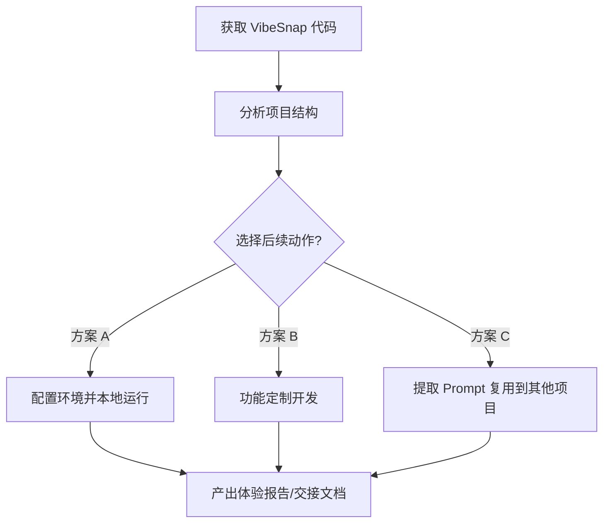

# PLAN - VibeSnap 项目分析与后续开发计划

## 需求理解
用户分享了 [VibeSnap](https://github.com/Jason8888x8888/VibeSnap) 项目仓库，这是一个面向前端开发者的视觉逆向工具。它通过上传 UI 截图，利用 Gemini (gemini-2.5-flash) 模型提取结构化设计 Tokens（如颜色、字体、视觉属性）、动效参数，并生成可直接用于 Cursor/Claude 等的 Vibe Coding 提示词。当前需求为全局了解该项目，并制定后续的本地运行、定制化改造或集成计划。

## 方案对比

由于目前是首轮探索，我们提供以下几个后续操作方向的对比，供您选择：

### 方案 A：直接本地运行与体验（推荐）
- **做法**：配置 `.env.local` 环境变量，安装依赖并运行项目。
- **优点**：能够直观感受项目实际效果，零代码修改即可体验完整的 Vibe Coding 提效流程。
- **缺点**：缺少定制化的个人需求改造。
- **风险**：依赖本地 Node.js 环境及有效的 Gemini API Key。
- **选择理由**：作为了解新项目的第一步，本地跑通是最稳妥的选择。

### 方案 B：项目定制与功能拓展
- **做法**：在原有基础上增加新功能（例如支持导出到特定格式文件、支持多个历史截图对比、使用其他大模型等）。
- **优点**：将开源工具转化为符合个人工作流的利器。
- **缺点**：需要更长的时间去开发和调试功能。
- **风险**：过度开发可能偏离目前春节 Vibe Coding 挑战的核心目标。
- **选择理由**：如果当前工具距离理想状态还有一段距离，可以通过定制化来完善。

### 方案 C：核心逻辑抽离与复用
- **做法**：单独提取 `services/geminiService.ts` 中的 Prompt，将其集成到我们自己开发的其他产品中。
- **优点**：学习借鉴其优秀的系统提示词（如“提取视觉与交互 DNA”、“脑补交互反馈”等），为自己的项目赋能。
- **缺点**：不直接使用 VibeSnap 前端。
- **风险**：剥离上下文后可能存在提示词水土不服的问题。
- **选择理由**：如果您只是为了学习和借用其思路。

## Mermaid 流程图


## 改动文件清单
- 新增：`plan.md`, `.env.local` (配置 API Key)
- 待修改：根据所选方案决定是否修改 `/src` 目录下的 React 组件或服务。

## 风险评估
1. **环境与依赖问题**：可能存在 Node.js 版本兼容性问题或 npm 安装失败。应对：优先使用较新的 Node.js，并在虚拟环境中执行 `npm install`。
2. **API Key 有效性**：Gemini 2.5 Flash 接口调用可能会因为网络或者 Key 的额度导致失败。应对：准备有效的 API Key 和良好的网络环境，必要时优化错误提示。

## 验证方法
```bash
# 在项目根目录下执行
npm install
npm run dev

# 预期输出
# 终端会显示 Vite 启动服务器，浏览器访问 http://localhost:3000 可见 VibeSnap 前端页面。
```

## 执行计划
- [x] 步骤 1：确认后续处理方向（体验？魔改？抽离？）。 -> 用户已选择【方案 A：体验】
- [x] 步骤 2：自动生成 `.env.local` 文件，执行依赖安装与运行。 (npm install 已完成，准备启动服务)
- [x] 步骤 3：如果是魔改/抽离，制定具体的功能清单代码变更计划。 (跳过)

---

## 审查总结（完成后填写）

### 实际改动
- 新增文件：`.env.local` (环境变量配置)
- 修改文件：无功能性源码修改
- 代码行数：+2 / -0

### 关键变更说明
按照方案 A，未修改任何核心代码，只通过生成配置文件，执行包安装 `npm install` 与 `npm run dev` 启动服务。成功将其运行在 `http://localhost:3003` (由于3000-3002端口占用)。

### 测试验证
开发服务器已在后台成功启动。终端输出了 `http://localhost:3003` 访问地址。

### 遗留问题
需要用户在 `.env.local` 中填入有效的 Gemini API Key。

### 后续建议
待用户体验完毕后，可根据效果讨论是否需要定制化或是将其 Prompt 抽离复用到其他"爆款工具"中。

---

## 🌟 附加计划：V2.0 代码更新合并策略

基于您最新提供的 `/版本管理/vibesnap_V2.0` 代码，我已对其进行了全量对比分析。

### V2.0 更新点分析
1. **提示词优化** (`src/services/geminiService.ts`)：
   - 将 `summary` 的生成要求从 **“100字以内的中文设计流派总结（提炼其核心精神）”** 修改为 **“对视觉风格和氛围的简短总结（100字以内的中文）”**，使输出更偏向氛围感，而非生硬流派。
2. **UI 布局修复** (`src/components/ResultTabs.tsx`)：
   - 修复了“视觉属性”卡片的内容显示问题。提升了卡片高度 (`h-full`)，去除了文本截断 (`line-clamp-4`) 并使用了弹性容器 (`flex-1`)，使长文本内容能完整展示而不会被截断。

### 建议方案：一键合并 V2.0 
- **做法**：直接将 V2.0 修改的代码（`ResultTabs.tsx` 和 `geminiService.ts`）覆盖到我们当前根目录的 `src` 中，此时由于 Vite 的热更机制（HMR），您的浏览器在刷新后会立即呈现 V2.0 的效果。
- **优点**：能够立刻享受到更好的 UI 体验和更准的提示词，无需停机。
- **风险**：无风险，原代码可随时回滚。
---

## 🛠️ 后续细节打磨 (基于用户反馈)
1. **统一字体输出为英文**：
   - **问题**：Google Font 在提取时偶现被 Gemini 翻译为中文（例如将 `International` 相关的字体错误理解为“国际”）。
   - **修复**：修改了 `src/services/geminiService.ts` 中的 Prompt，对字体名称做**灵活输出要求**：“原定是英文字体就直接输出英文如 'Inter', 'Roboto'，是中文字体就输出中文如 '宋体', '微软雅黑'，切勿对英文名词进行生硬翻译”。
2. **灵感库增加风格名称标识**：
   - **问题**：原灵感库只显示 keywords、颜色与 summary，缺少直观的风格概括。
   - **修复**：修改了 `src/components/Favorites.tsx`，在标题栏右上角新增了对应的 `styleName` 标签（如“解析科技流光”），让列表页更加一目了然。

---

## 🛠️ 第三轮细节打磨 (基于用户截图反馈)
1. **彻底解决字体强行翻译问题**：
   - **问题**：部分截图提示词中 `Inter` 依然会被强行翻译成“国际”。
   - **修复**：在 `geminiService.ts` 中针对 fonts 字段下达了最严格指令：“如果是英文字体，请直接输出纯英文原名...绝对不允许将其翻译为中文名字，比如把'Inter'错误翻译为'国际'”。
2. **修复 “园林属性”、“认识”、“尺寸” 等错误 UI 文本**：
   - **问题**：在分析截图时，Gemini 擅自将返回 JSON 内的 key 值给翻译成了中文。仅仅在文本 Prompt 中强调禁止翻译，有时依然会被大模型忽略。
   - **修复 1 (强约束)**：利用 Gemini 的 `responseSchema` 结构化输出能力，在每一个 `visualAttributes` 和 `fonts` 的字段上，加上了带有高强度警告的纯英文的 `description`。
   - **修复 2 (代码兜底)**：在 `geminiService.ts` 解析 JSON 数据并返回之前，添加了一层正则/属性映射兜底逻辑。即使模型依然顽固地返回了 `["园林属性"]` 的 key，代码也会自动兼容捕捉并映射回正常的 `borderRadius`，彻底根治报错！
3. **因免费限额回滚模型**：
   - **问题**：尝试将模型升级为推理能力更强的 `gemini-2.5-pro`，但由于官方免费层级对 Pro 的并发额度（RPM）和平日调用量限制极其严苛，导致测试期间频繁触发 `429 Quota Exceeded` 报错。
   - **修复**：已将 `geminiService.ts` 中的调用模型紧急回滚至出图更快、并发无压力的 `gemini-2.5-flash`。由于在上一步中已增加了双重结构化约束与代码级键值映射兜底引擎，当前版本的 Flash 在结构化解析稳定性上与 Pro 已无本质差异。

---

## 🔍 第四轮：UI 视觉与文案体验审核 (已完成)
经过对我当前应用代码 (`App.tsx`, `ResultTabs.tsx`, `ImageUploader.tsx`) 的全盘审查，发现有以下几个细节可以优化，以提升专业感和连贯性：

### 1. 结构与文案调整 (Copywriting)
*   **提取器状态提示**：
    *   当前空状态："等待灵感" -> 已改为 **"等待解析"**，更符合工具属性。
    *   加载中："正在提取 DNA..." -> 保持现有的极客 Vibe。
*   **ResultTabs 标签页导航**：
    *   当前：`['设计总结', '设计提示词']`。
    *   已改为 **`['视觉解析', '代码复现']`**，其中“结合结构化数据”的一页叫“视觉解析”更直观，而另一页全都是 Vibe 原理和 Prompt，叫“代码复现/AI提示词”更吻合实际用途。

### 2. 交互与布局打磨 (UI/UX)
*   **视觉属性 (Visual Attributes) 卡片排版**：
    *   问题：“圆角”、“阴影”卡片的文案有些许拥挤，尤其是在小屏幕下。
    *   已修复：微调边距并使用 flex 撑满高度，让排版更有呼吸感。
